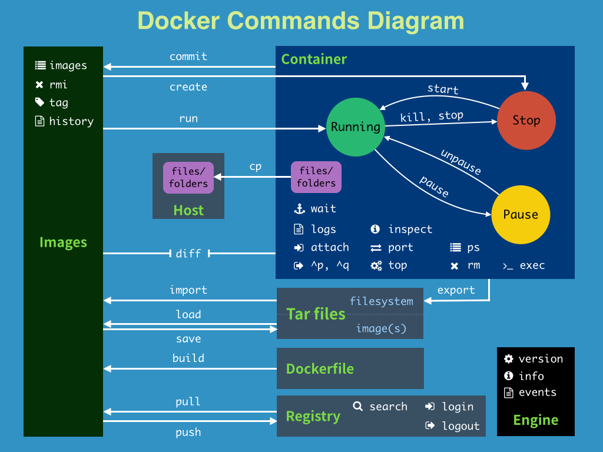

Docker 基础入门篇
---

### 目录

1. [安装](#2-安装)
    - 1.1. [系统要求](#11-系统要求)
    - 1.2. [自动安装脚本](#12-自动安装脚本)
    - 1.3. [手动安装](#13-手动安装)
2. [镜像](#2-镜像)
	- 3.1. [常用操作命令](#21-常用操作命令)
	- 3.2. [镜像加速器](#22-镜像加速器)
3. [容器](#3-容器)
	- 3.1. [常用操作命令](#31-常用操作命令)
4. [附录](#4-附录)
	- 4.1. [Docker 常用命令图解](#41-docker-常用命令图解) 

---


### 1. 安装

#### 1.1. 系统要求（x64 位、内核版本 >= 3.10）

> 可通过命令 uname -a 查看系统基本信息

+ Ubuntu 16.04 Xenial +
+ Debian 8 Jessie +
+ CentOS7 +

#### 1.2. 自动安装脚本（适用于 Ubuntu、Debian、CentOS） 👍

```bash
# 官方
$ curl -sSL https://get.docker.com/ | sh

# 阿里云
$ curl -sSL http://acs-public-mirror.oss-cn-hangzhou.aliyuncs.com/docker-engine/internet | sh -

# DaoCloud
$ curl -sSL https://get.daocloud.io/docker | sh
```

注意：自动安装脚本只安装 docker-enginie，如果需要使用 docker-compose，请按照如下步骤安装

```bash
$ curl -L https://github.com/docker/compose/releases/download/1.19.0/docker-compose-`uname -s`-`uname -m` -o /usr/local/bin/docker-compose
$ chmod +x /usr/local/bin/docker-compose
$ docker-compose -v
```

#### 1.3. 手动安装

+ [Ubuntu](https://www.docker.com/docker-ubuntu)
+ [Debian](https://www.docker.com/docker-debian)
+ [CentOS](https://www.docker.com/docker-centos-distribution)
    
### 2. 镜像

Docker 镜像是一个特殊的文件系统，除了提供容器运行时所需的程序、库、资源、配置等文件外，还包含了一些为运行时准备的一些配置参数（如匿名卷、环境变量、用户等）。**镜像不包含任何动态数据，其内容在构建之后也不会被改变。**

Docker 镜像是怎么实现增量的修改和维护的？ 每个镜像都由很多层次构成，Docker 使用 [Union FS](https://en.wikipedia.org/wiki/Union_mount) 将这些不同的层结合到一个镜像中去。

通常 Union FS 有两个用途：

- 实现不借助 LVM、RAID 将多个 disk 挂到同一个目录下；
- 将一个只读的分支和一个可写的分支联合在一起，Live CD 正是基于此方法可以允许在镜像不变的基础上允许用户在其上进行一些写操作。

Docker 在 AUFS 上构建的容器也是利用了类似的原理。

#### 2.1. 常用操作命令

```bash
# 搜索镜像
$ docker search ubuntu:16.04

# 获取镜像
$ docker pull [选项] [Docker Registry地址]<仓库名>:<标签>

# 列出镜像（只会显示顶层镜像）
$ docker images

# 删除镜像（需要先删除依赖该镜像的容器）
$ docker rmi [选项] <镜像1> [<镜像2> ...]

# 删除所有虚悬镜像
$ docker rmi $(docker images -q -f dangling=true)

# 删除所有仓库名包含 redis 的镜像
$ docker rmi $(docker images -q redis)

# 修改镜像标签
$ sudo docker tag <镜像ID> <标签名>

# 导出镜像存储文件
$ docker save -o 导出镜像名.tar.gz <镜像ID 或 镜像名:tag>

# 导入镜像存储文件（包含镜像以及相关元数据信息，比如标签等）
$ docker load < 导出镜像名.tar.gz
或
$ docker load --input 导出镜像名.tar.gz

# 其它

```

#### 2.2. 镜像加速器 👍

由于国内访问 Docker Hub 有时会遇到困难，所以需要配置镜像加速器，推荐如下两个：

+ [DaoCloud](https://www.daocloud.io/mirror)
+ [阿里云](https://account.aliyun.com/login/login.htm?oauth_callback=https%3A%2F%2Fcr.console.aliyun.com%2F&lang=zh#/accelerator)

### 3. 容器

镜像（Image）和容器（Container）的关系，就像是面向对象程序设计中的类和实例一样，镜像是静态的定义，容器是镜像运行时的实体。

容器可以被创建、启动、停止、删除、暂停等。

容器的实质是**进程**，但与直接在宿主执行的进程不同，容器进程运行于属于自己的独立的 命名空间。因此容器可以拥有自己的 root 文件系统、自己的网络配置、自己的进程空间，甚至自己的用户 ID 空间。容器内的进程是运行在一个隔离的环境里，使用起来，就好像是在一个独立于宿主的系统下操作一样。这种特性使得容器封装的应用比直接在宿主运行更加安全。也因为这种隔离的特性，很多人初学 Docker 时常常会把容器和虚拟机搞混。

> 按照 Docker 最佳实践的要求，**容器不应该向其存储层内写入任何数据，容器存储层要保持无状态化**。所有的文件写入操作，都应该使用 数据卷（Volume）、或者绑定宿主目录，在这些位置的读写会跳过容器存储层，直接对宿主(或网络存储)发生读写，其性能和稳定性更高。

#### 3.1. 常用操作命令

```bash
# 输出一个“hello world”后终止容器
$ docker run ubuntu:16.04 /bin/echo 'hello world'
hello world

# 启动一个 bash 终端，允许用户进行交互
$ docker run -it ubuntu:16.04 /bin/bash 
root@0eb917598209:/# exit 
exit
$

# 后台运行，主要使用 -d 参数
$ docker run -d ubuntu:16.04 /bin

# 查看运行中的容器
$ docker ps

# 查看所有容器
$ docker ps -a

# 进入容器
# 方法一：attach 此方法会受命令阻塞影响，并且 exit 退出后将同时关闭容器
$ docker attach <容器id>
# 方法二：exec（推荐）
$ docker exec -it $CONTAINER_ID /bin/bash

# 关闭容器
$ docker stop $CONTAINER_ID

# 启动已关闭的容器
$ docker start $CONTAINER_ID

# 获取容器的输出信息（-f 选项用于持续获取）
$ docker logs $CONTAINER_ID

# 查看容器的相关信息
$ docker inspect $CONTAINER_ID

# 删除容器
$ docker rm $CONTAINER_ID-1 $CONTAINER_ID-2 $CONTAINER_ID-3 ...

# 删除所有未运行的容器
$ docker rm $(docker ps -a -q)

# 导出容器快照（将丢弃历史记录和元数据信息）
$ docker export <容器ID> > <导出文件名>.tar

# 从容器快照导入镜像
$ cat <导出文件名>.tar | docker import - <导入之后的镜像名:标签>

# 在宿主机与容器之间相互拷贝文件
$ docker cp [OPTIONS] $CONTAINER_ID:容器中的文件路径 本地目标路径
$ docker cp [OPTIONS] 本地文件路径 $CONTAINER_ID:容器中的目标路径
```

### 4. 附录

#### 4.1. Docker 常用命令图解

